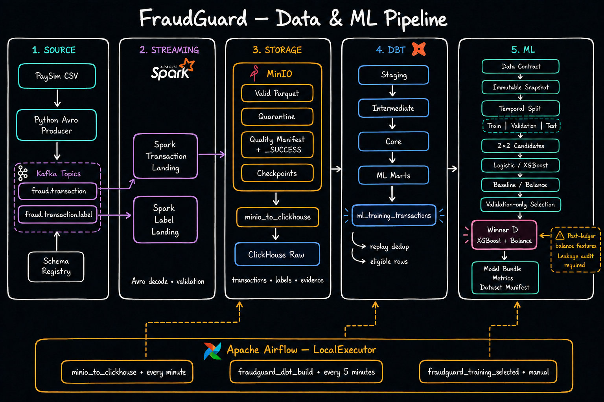
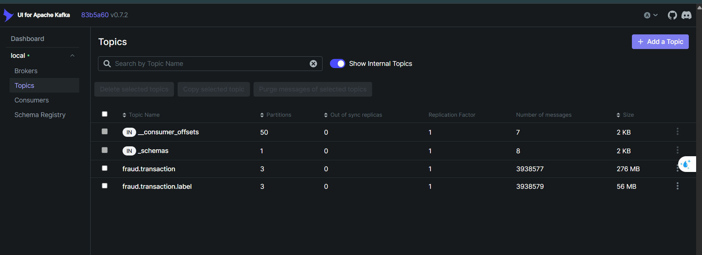
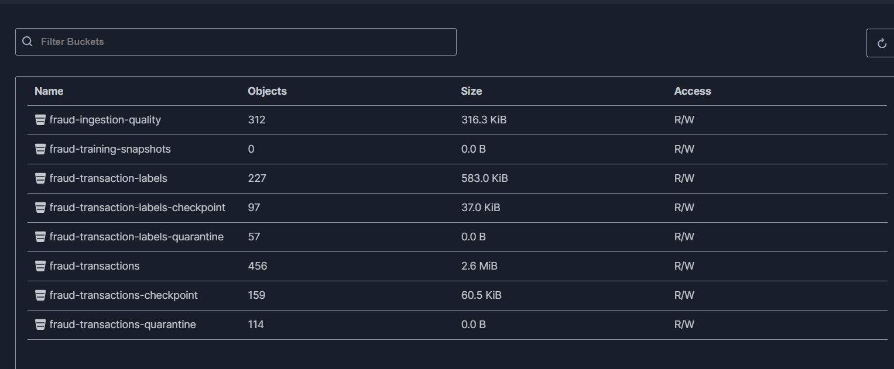
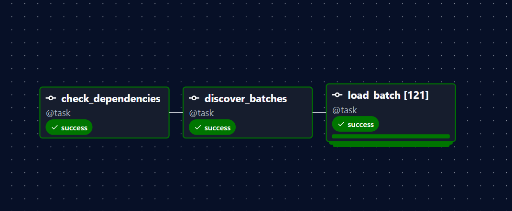
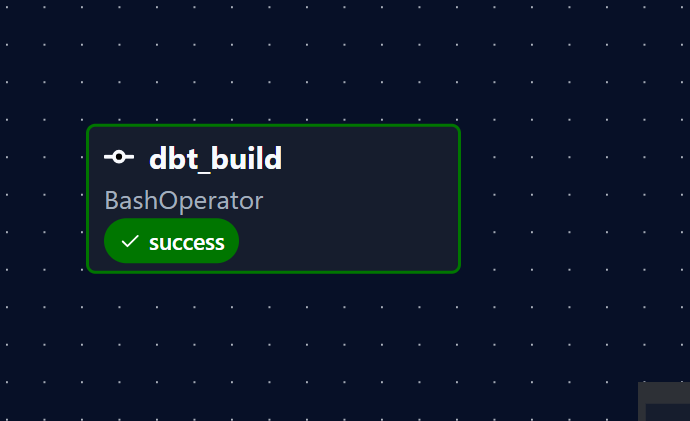
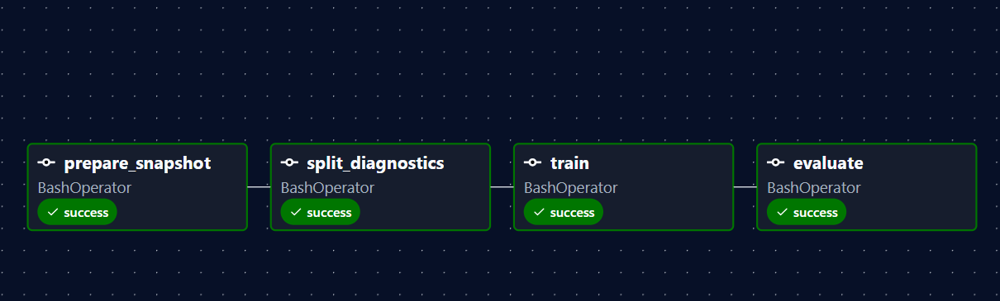
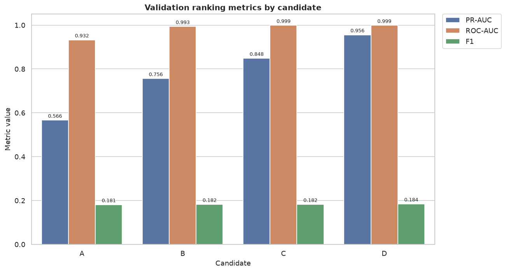
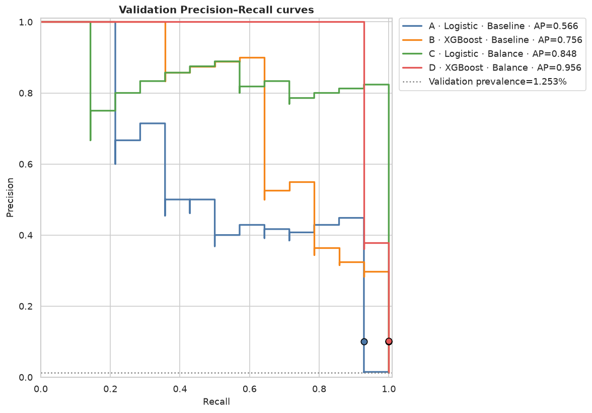
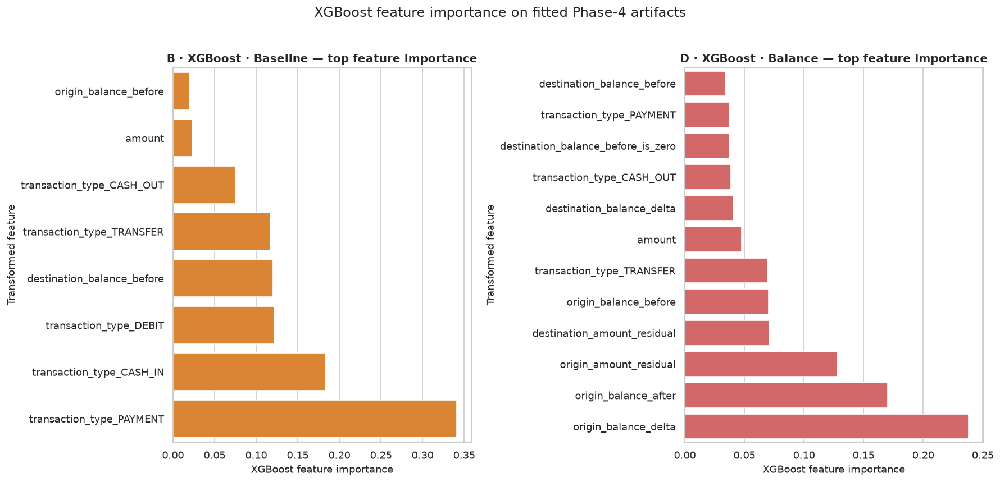

# FraudGuard — Local Banking Fraud Data & ML Pipeline

FraudGuard là dự án demo một quy trình dữ liệu và machine learning end-to-end cho
bài toán phát hiện giao dịch gian lận ngân hàng. Dữ liệu PaySim được phát lại như
một luồng sự kiện, kiểm tra schema và chất lượng, lưu thành các landing bất biến,
chuẩn hóa bằng dbt, snapshot có lineage, sau đó huấn luyện và đánh giá mô hình
theo cách chia dữ liệu thời gian. Dự án hiện so sánh Logistic Regression và
XGBoost trên hai bộ feature, sau đó đưa model được chọn vào DAG training riêng.

## 1. Mục tiêu bài toán và kết quả đạt được

### Mục tiêu

- Xây dựng pipeline có thể tái hiện từ `CSV → Kafka → Spark → MinIO → ClickHouse
  → dbt → ML` trên một máy local bằng Docker Compose.
- Tách transaction và final fraud label thành hai luồng Avro độc lập, hỗ trợ kiểm
  tra schema, quarantine và replay.
- Chỉ đưa các batch hoàn chỉnh, đối soát được vào ClickHouse; chuẩn hóa thành tập
  train không chứa feature leakage.
- Tạo snapshot Parquet bất biến kèm manifest, hash, Git SHA, data fingerprint và
  thống kê temporal split để một model run có thể truy vết lại.
- So sánh bốn candidate `Logistic Regression/XGBoost × baseline/balance`, chỉ
  dùng validation để chọn model và khóa test cho lần đánh giá cuối.
- Đưa XGBoost với balance-consistency features vào DAG training đã chọn; threshold
  được chọn trên validation theo chiến lược `max_recall_at_min_precision`.

### Các con số chính

| Hạng mục | Kết quả đã quan sát |
| --- | ---: |
| PaySim CSV đầy đủ | 6.362.620 giao dịch, 11 cột, step 1–743 |
| Fraud trong toàn bộ CSV | 8.213 giao dịch — 0,1291% |
| Fraud theo loại giao dịch | CASH_OUT: 4.116; TRANSFER: 4.097 |
| Kiểm tra domain EDA | 0 type sai, 0 `isFraud` sai, 0 `isFlaggedFraud` sai |
| Snapshot model demo | 6.534 dòng, 54 fraud — 0,8264% |
| Temporal split demo | Train 3.723/24 fraud; Validation 1.117/14; Test 1.694/16 |
| Experiment winner trên validation | Candidate D — XGBoost + balance features |
| Winner validation PR-AUC / recall | 0,9556 / 100% — bắt 14/14 fraud |
| Selected-model test ROC-AUC / PR-AUC | 1,0000 / 1,0000 |
| Selected-model test recall / fraud capture | 100% — bắt 16/16 fraud |
| Selected-model test precision / alert rate | 7,21% / 13,11% |
| Selected-model test confusion matrix | TP 16 · FN 0 · FP 206 · TN 1.472 |

> [!IMPORTANT]
> Các metric model phía trên **chỉ có giá trị tham khảo để chứng minh pipeline
> hoạt động end-to-end**. EDA đã đọc toàn bộ CSV 6,36 triệu dòng, nhưng snapshot
> dùng để train mới có 6.534 dòng và chỉ 54 fraud vì dữ liệu streaming chưa được
> load đầy đủ. Test chỉ có 16 fraud; PR-AUC/ROC-AUC bằng 1,0 vì vậy có độ bất định
> rất lớn và không phải bằng chứng model sẵn sàng production.


## 2. Kiến trúc



Luồng chính:

1. `producer/kafka_producer.py` đọc `data/data.csv`, tạo `event_id` xác định,
   chuyển PaySim step thành thời gian nghiệp vụ và publish hai message Avro cho
   mỗi giao dịch.
2. Kafka lưu hai topic, mỗi topic 3 partition:
   `fraud.transaction` và `fraud.transaction.label`. Schema Registry quản lý
   writer/reader schema với backward compatibility.
3. Hai Spark Structured Streaming job kiểm tra Confluent envelope, giải mã Avro,
   áp dụng domain validation rồi ghi valid Parquet, replayable quarantine,
   quality manifest và checkpoint lên MinIO.
4. DAG `minio_to_clickhouse` chỉ khám phá batch có quality `_SUCCESS`, kiểm tra
   `input = valid + quarantine`, đối chiếu row count rồi mới ghi raw tables và
   trạng thái ingestion vào ClickHouse.
5. dbt tạo các lớp `staging → intermediate → core → ml`, canonicalize replay theo
   business key `(source, event_id)`, phát hiện payload conflict và loại dòng
   không đủ điều kiện train.
6. DAG `fraudguard_training_selected` chạy quality gate, tạo immutable snapshot,
   temporal split, split diagnostics, train XGBoost với bộ balance features và
   evaluate trên test set chưa từng dùng để chọn model hoặc threshold.

### Orchestration

| DAG | Lịch chạy | Vai trò |
| --- | --- | --- |
| `minio_to_clickhouse` | Mỗi phút | Khám phá, validate và dynamically map các batch MinIO vào ClickHouse |
| `fraudguard_dbt_build` | Mỗi 5 phút | Build models và chạy dbt tests với fail-fast |
| `fraudguard_training_selected` | Manual | Snapshot → diagnostics → selected model → test evaluation |

## 3. Kết quả chạy pipeline

### Kafka và Schema Registry

Kafka UI cho phép theo dõi hai topic nghiệp vụ, partition, message count và
Schema Registry tại `http://localhost:8080`.



### MinIO landing zone

MinIO tách riêng valid data, quarantine, checkpoint, ingestion quality và
training snapshot. Quality manifest được ghi cuối cùng để `_SUCCESS` trở thành
publication boundary của từng micro-batch.



### Airflow — MinIO sang ClickHouse

`load_batch` dùng dynamic task mapping; ảnh demo ghi nhận 121 batch được load
thành công sau các bước kiểm tra dependency và discovery.



### Airflow — dbt quality gate

dbt build materialize các lớp dữ liệu và chạy schema, uniqueness, relationship,
domain cùng các singular data-quality tests.



### Airflow — selected-model training

Training DAG chạy tuần tự bốn bước: chuẩn bị snapshot, chẩn đoán split, train và
evaluate. Mặc định DAG dùng `training_selected.yml` cho XGBoost + balance features;
baseline Logistic Regression vẫn được giữ làm cấu hình rollback rõ ràng. Artifact
chỉ được xuất khi data contract và các điều kiện split đạt.



## 4. Thiết kế dữ liệu và kiểm soát chất lượng

### Event contracts

- Transaction Avro chứa event time, ingestion time, loại giao dịch, số tiền, tài
  khoản và số dư trước/sau giao dịch.
- Label Avro chứa `event_id`, `source`, `isFraud`, `isFlaggedFraud` và được phát
  trên topic riêng để mô phỏng ranh giới giữa online event và offline final label.
- Producer bật idempotence, `acks=all`, retry và dùng cùng business key cho event
  và label.

### Landing và quarantine

Spark loại các message có envelope sai, schema ID không hỗ trợ, decode thất bại,
timestamp không hợp lệ hoặc fraud flag ngoài miền. Quarantine giữ Kafka topic,
partition, offset, timestamp và payload base64 để có thể điều tra hoặc replay.

Mỗi quality manifest chứa:

- `pipeline`, `batch_id`, `event_date`, `source`;
- `input_rows`, `valid_rows`, `quarantine_rows`;
- điều kiện bắt buộc `input_rows = valid_rows + quarantine_rows`.

### dbt layers

| Layer | Database | Nội dung |
| --- | --- | --- |
| Raw | `fraudguard` | Transaction, label, ingestion batches và quality evidence |
| Staging | `fraudguard_staging` | Chuẩn hóa type và tên cột |
| Intermediate | `fraudguard_intermediate` | Chỉ nhận committed batch, rank replay và payload version |
| Core | `fraudguard_core` | Canonical transaction, canonical label và labeled transaction |
| ML | `fraudguard_ml` | Candidate population, exclusion summary và training relation |

Các dòng thiếu final label, payload conflict, amount âm hoặc balance âm bị loại
khỏi `ml_training_transactions`. ClickHouse sử dụng các role tách biệt cho loader,
dbt transformer và read-only ML reader.

## 5. Machine learning và model experiments

### 5.1. Thiết kế experiment

Experiment so sánh hai họ model trên cùng một population fingerprint, temporal
split và threshold strategy:

| Candidate | Model | Bộ feature |
| --- | --- | --- |
| A | Logistic Regression | Baseline |
| B | XGBoost | Baseline |
| C | Logistic Regression | Balance |
| D | XGBoost | Balance |

Bộ baseline gồm `transaction_type`, `amount`, `origin_balance_before` và
`destination_balance_before`. Bộ balance mở rộng lên 13 feature bằng số dư sau
giao dịch, balance delta, amount residual và các cờ zero-balance. Các cột định
danh, thời gian, target và `is_flagged_fraud` bị cấm làm feature để tránh leakage.

Logistic Regression dùng one-hot encoding, standard scaling và
`class_weight="balanced"`. XGBoost dùng `binary:logistic`, `aucpr`, histogram
trees, early stopping và `scale_pos_weight` tính từ tỷ lệ class ở train. Cả hai
dùng seed 42. Dữ liệu được chia theo thời gian, không shuffle:

| Split | Khoảng thời gian | Số dòng | Fraud |
| --- | --- | ---: | ---: |
| Train | 00:00–02:00 UTC | 3.723 | 24 |
| Validation | 02:00–04:00 UTC | 1.117 | 14 |
| Test | 04:00–06:00 UTC | 1.694 | 16 |

### 5.2. Kết quả validation và model selection

Kết quả controlled run `20260825T082223Z`:

| Candidate | Validation PR-AUC | ROC-AUC | Precision | Recall | Alert rate | Train time |
| --- | ---: | ---: | ---: | ---: | ---: | ---: |
| A · Logistic · Baseline | 0,5661 | 0,9323 | 10,00% | 92,86% | 11,64% | 0,124 s |
| B · XGBoost · Baseline | 0,7560 | 0,9934 | 10,00% | 100% | 12,53% | 0,219 s |
| C · Logistic · Balance | 0,8484 | 0,9986 | 10,00% | 100% | 12,53% | 0,146 s |
| **D · XGBoost · Balance** | **0,9556** | **0,9985** | **10,14%** | **100%** | **12,35%** | **0,189 s** |





Quy tắc chọn model yêu cầu precision tối thiểu 10%, sau đó ưu tiên recall,
PR-AUC và alert rate. Candidate D được chọn vì bắt đủ 14/14 fraud trên validation,
có PR-AUC cao nhất và vượt candidate Logistic tốt nhất 0,1072 PR-AUC. Test không
được dùng trong quá trình so sánh hoặc chọn candidate.

Balance-consistency features tạo cải thiện rõ rệt cho cả hai họ model. Với
XGBoost, feature importance cũng cho thấy các biến residual/delta đóng góp tín
hiệu bổ sung ngoài amount và loại giao dịch:



### 5.3. Đánh giá selected model trên test

DAG `fraudguard_training_selected` huấn luyện lại candidate D bằng
`configs/training_selected.yml`, chọn threshold hoàn toàn trên validation, sau đó
đánh giá test đúng một lần. Run `20260826T030355` cho kết quả:

| Metric test | Kết quả |
| --- | ---: |
| ROC-AUC / PR-AUC | 1,0000 / 1,0000 |
| Precision / recall | 7,21% / 100% |
| F1 / alert rate | 0,1345 / 13,11% |
| Confusion matrix | TP 16 · FN 0 · FP 206 · TN 1.472 |

Kết quả ranking hoàn hảo cần được đọc cùng kích thước test rất nhỏ. Threshold
đạt precision gate trên validation nhưng precision giảm còn 7,21% trên test, cho
thấy threshold và tải cảnh báo chưa ổn định.

### 5.4. Tái lập experiment và artifacts

Chạy lại ma trận bốn candidate trên cùng snapshot logic:

```bash
bash scripts/run_experiment.sh
```

Notebook `notebooks/experiment_models.ipynb` đọc artifact của bốn candidate, kiểm
tra population fingerprint, tạo bảng/biểu đồ và áp dụng model-selection rule.
Các báo cáo đã export nằm trong
`reports/model_experiments/20260825T082223Z/`.

Snapshot manifest lưu data/config/dbt/query hash, population fingerprint, Git SHA,
feature list, split boundaries và split statistics. Model artifact liên kết lại
manifest qua SHA-256. Artifact của mỗi selected-model run nằm tại:

```text
airflow_ml_artifacts/training/<run_id>/
├── artifact.json
├── dbt_target/
└── experiment/
    ├── data.parquet
    ├── dataset_manifest.json
    ├── split_diagnostics.json
    ├── evaluation.json
    └── model/
        ├── model_bundle.joblib
        └── validation_metrics.json
```

## 6. Chạy dự án từ đầu đến cuối

### Yêu cầu

- Docker Engine và Docker Compose;
- Python 3.12+;
- `uv`;
- PaySim CSV với 11 cột gốc tại `data/data.csv`.

### 6.1. Chuẩn bị môi trường

```bash
cd /home/phongthanh/ML_Fraud_Banking

cp .env.example .env
nano .env

uv sync --all-groups
docker compose up -d --build
docker compose ps
```

Thay toàn bộ giá trị `replace-with-...` trong `.env` trước khi khởi động. Không
commit `.env` hoặc credentials thật.

Pool `dbt_clickhouse` cần tồn tại trước khi chạy training:

```bash
docker compose exec airflow-scheduler airflow pools set \
  dbt_clickhouse 1 "Serialize dbt and ClickHouse training preparation"
```

### 6.2. Chạy hai Spark landing jobs

```bash
docker compose exec -d spark-master /opt/spark/bin/spark-submit \
  --master spark://spark-master:7077 \
  /opt/spark/jobs/event_kafka_minio.py

docker compose exec -d spark-master /opt/spark/bin/spark-submit \
  --master spark://spark-master:7077 \
  /opt/spark/jobs/labels_kafka_minio.py
```

Các job được khởi chạy bằng `docker compose exec`, không phải service riêng trong
Compose. Vì vậy phải chạy lại hai lệnh này nếu Spark container bị recreate hoặc
restart.

### 6.3. Publish PaySim vào Kafka

Smoke test nhỏ:

```bash
uv run python producer/kafka_producer.py \
  --data-path data/data.csv \
  --events-per-second 100 \
  --max-records 10000
```

Phát toàn bộ file nhanh nhất có thể:

```bash
uv run python producer/kafka_producer.py \
  --data-path data/data.csv \
  --events-per-second 0
```

### 6.4. Bật ingestion và dbt DAGs

```bash
docker compose exec airflow-scheduler airflow dags unpause minio_to_clickhouse
docker compose exec airflow-scheduler airflow dags unpause fraudguard_dbt_build
```

Có thể trigger ngay thay vì chờ schedule:

```bash
docker compose exec airflow-scheduler airflow dags trigger minio_to_clickhouse
docker compose exec airflow-scheduler airflow dags trigger fraudguard_dbt_build
```

### 6.5. Chạy training

Trước khi train, cần chắc chắn mỗi temporal split đều có dòng và fraud positive.
Config demo hiện dùng khoảng thời gian 6 giờ đầu:

```yaml
train_end: "2026-01-01T02:00:00Z"
validation_end: "2026-01-01T04:00:00Z"
test_end: "2026-01-01T06:00:00Z"
```

Chạy DAG:

```bash
docker compose exec airflow-scheduler \
  airflow dags unpause fraudguard_training_selected

docker compose exec airflow-scheduler \
  airflow dags trigger \
  --conf '{"config_file":"training_selected.yml"}' \
  fraudguard_training_selected
```

Để rollback có chủ đích về Logistic Regression baseline, truyền
`training_baseline.yml` thay cho `training_selected.yml`. DAG chỉ chấp nhận hai
config đã được allowlist này.

### 6.6. Kiểm thử local

```bash
uv run pytest --no-cov
uv run ruff check .
uv run mypy
./scripts/dbt.sh build --target dev --fail-fast
```

Quality gate đầy đủ được chạy bằng `uv run pytest`. Ở trạng thái hiện tại, cả 33
test đều pass nhưng command vẫn trả exit code khác 0 vì tổng coverage 16,58% chưa
đạt ngưỡng `--cov-fail-under=80`. `uv run mypy` không báo lỗi trên 23 source files;
`ruff check .` còn 12 lỗi trong hai Python modules và hai notebook. Đây là
technical debt đã biết, không nên diễn giải là toàn bộ CI đang xanh.

### 6.7. Dừng stack

```bash
docker compose down
```

Không thêm `-v` nếu muốn giữ Kafka, MinIO, ClickHouse và Airflow metadata volumes.

## 7. Giao diện local

| Service | URL | Ghi chú |
| --- | --- | --- |
| Kafka UI | <http://localhost:8080> | Topics, consumer và Schema Registry |
| Schema Registry API | <http://localhost:8081> | Avro subjects và versions |
| MinIO Console | <http://localhost:9001> | Landing, quarantine, quality, checkpoint và snapshot |
| Spark Master UI | <http://localhost:8083> | Worker, application và executor |
| Spark Worker UI | <http://localhost:8082> | Executor chi tiết |
| Airflow | <http://localhost:8084> | DAG runs, tasks và logs |
| ClickHouse HTTP | <http://localhost:8123> | Query endpoint |

Credentials local lấy từ `.env`; giá trị trong `.env.example` chỉ dành cho phát
triển trên máy cá nhân.

## 8. Cấu trúc repository

```text
.
├── airflow/dags/                 # Ingestion, dbt và ML orchestration
├── clickhouse/init/              # Raw tables, databases, roles và users
├── configs/                      # Data contract và experiment configurations
├── data/                         # PaySim CSV local, không commit vào Git
├── dbt/                          # Staging, intermediate, core, ML marts và tests
├── docker/                       # Spark/Airflow images và Spark configuration
├── images/                       # Ảnh kết quả chạy Kafka, MinIO và Airflow
├── ml/src/fraudguard_ml/         # Snapshot, lineage, train, diagnostics, evaluate
├── ml/tests/                     # Unit tests
├── notebooks/                    # EDA và model experiment notebooks
├── producer/                     # CSV-to-Kafka Avro producer
├── reports/                      # EDA, model comparison và architecture outputs
├── schemas/                      # Transaction và label Avro schemas
├── scripts/run_experiment.sh     # Chạy ma trận model × feature set
├── spark/jobs/                   # Shared landing engine và hai entry-point jobs
├── docker-compose.yml
└── pyproject.toml
```

## 9. Giới hạn hiện tại

- Đây là **local demo**, dùng PaySim synthetic data; không đại diện hành vi gian
  lận thực tế hoặc yêu cầu latency/SLA production.
- Snapshot model mới chứa 0,10% số dòng của CSV đầy đủ
  (`6.534 / 6.362.620`), và chỉ có 54 fraud positive.
- Mốc split 2h/4h/6h được thu hẹp có chủ đích để demo training chạy được trước
  khi toàn bộ streaming backlog được load.
- Chưa có model serving, online inference, alert review workflow, model registry,
  drift monitoring, production secrets manager hay high-availability deployment.
- Spark jobs được submit thủ công và cấu hình local ưu tiên khả năng chạy trên máy
  cá nhân hơn throughput tối đa.
- Experiment hiện mới dùng một temporal split với 14 fraud ở validation và 16
  fraud ở test; chưa có repeated folds, confidence interval hay kiểm định độ ổn
  định theo thời gian.
- Việc chọn candidate đã có rule và selected config, nhưng chưa có model registry,
  approval workflow hoặc cơ chế promotion/rollback tự động.

## 10. Hướng cải tiến

Các bước tiếp theo cho phần modeling:

1. Load đủ 6,36 triệu dòng và mở rộng temporal split theo toàn bộ thời gian thay
   vì cửa sổ demo sáu giờ.
2. Chạy repeated temporal folds/seeds, báo confidence interval và stability theo
   từng giai đoạn thay vì dựa trên 14–16 fraud positive.
3. Hiệu chỉnh probability và threshold theo chi phí review thực tế; theo dõi
   precision, recall, alert volume và calibration drift sau mỗi lần train.
4. Tự động hóa model-selection report từ artifact, thêm quality gate để chỉ tạo
   candidate promotion khi metric và data lineage đều hợp lệ.
5. Bổ sung model registry, approval workflow, serving, monitoring và rollback;
   giữ test set khóa cho đánh giá cuối của mỗi model version.
6. Thêm các test cho các phần của dữ liệu.
