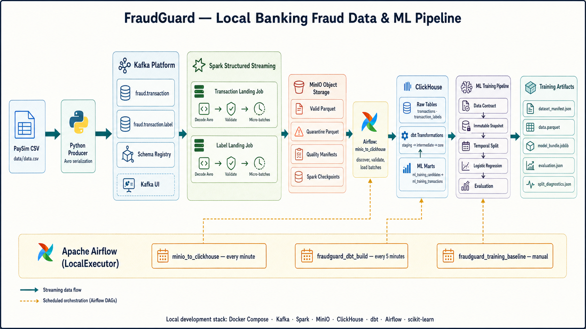

# FraudGuard — Local Banking Fraud Data & ML Pipeline

FraudGuard là dự án demo một quy trình dữ liệu và machine learning end-to-end cho
bài toán phát hiện giao dịch gian lận ngân hàng. Dữ liệu PaySim được phát lại như
một luồng sự kiện, kiểm tra schema và chất lượng, lưu thành các landing bất biến,
chuẩn hóa bằng dbt, snapshot có lineage, sau đó huấn luyện và đánh giá mô hình
theo cách chia dữ liệu thời gian.

## 1. Mục tiêu bài toán và kết quả đạt được

### Mục tiêu

- Xây dựng pipeline có thể tái hiện từ `CSV → Kafka → Spark → MinIO → ClickHouse
  → dbt → ML` trên một máy local bằng Docker Compose.
- Tách transaction và final fraud label thành hai luồng Avro độc lập, hỗ trợ kiểm
  tra schema, quarantine và replay.
- Chỉ đưa các batch hoàn chỉnh, đối soát được vào ClickHouse; chuẩn hóa thành tập
  train không chứa feature leakage.
- Tạo snapshot Parquet bất biến kèm manifest, hash, Git SHA, data fingerprint và
  thống kê temporal split để một model run có thể truy vết lại.
- Huấn luyện baseline Logistic Regression và chọn threshold trên validation theo
  chiến lược `max_recall_at_min_precision`.

### Các con số chính

| Hạng mục | Kết quả đã quan sát |
| --- | ---: |
| PaySim CSV đầy đủ | 6.362.620 giao dịch, 11 cột, step 1–743 |
| Fraud trong toàn bộ CSV | 8.213 giao dịch — 0,1291% |
| Fraud theo loại giao dịch | CASH_OUT: 4.116; TRANSFER: 4.097 |
| Kiểm tra domain EDA | 0 type sai, 0 `isFraud` sai, 0 `isFlaggedFraud` sai |
| Snapshot model demo | 6.534 dòng, 54 fraud — 0,8264% |
| Temporal split demo | Train 3.723/24 fraud; Validation 1.117/14; Test 1.694/16 |
| Test ROC-AUC | 0,9158 |
| Test PR-AUC | 0,1437 |
| Test recall / fraud capture | 93,75% — bắt 15/16 fraud |
| Test precision | 8,29% |
| Test alert rate | 10,68% |
| Test confusion matrix | TP 15 · FN 1 · FP 166 · TN 1.512 |
| Python unit assertions | 33 passed khi chạy `pytest --no-cov` |
| Coverage hiện tại | 18,60% — chưa đạt quality gate 80% |
| Static typing | mypy: 0 lỗi trên 22 source files |
| dbt build quan sát gần nhất | PASS 157 · WARN 0 · ERROR 0 |

> [!IMPORTANT]
> Các metric model phía trên **chỉ có giá trị tham khảo để chứng minh pipeline
> hoạt động end-to-end**. EDA đã đọc toàn bộ CSV 6,36 triệu dòng, nhưng snapshot
> dùng để train mới có 6.534 dòng và chỉ 54 fraud vì dữ liệu streaming chưa được
> load đầy đủ. Đây là demo quy trình local, chưa phải kết quả production, chưa đủ
> để kết luận chất lượng mô hình hay chọn threshold vận hành.

Trên validation, threshold `0,07398` đạt đúng precision tối thiểu 10% với recall
92,86%; sang test, precision giảm còn 8,29%. Test chỉ có 16 fraud positive nên
mọi metric đều có độ bất định lớn. Mô hình cho thấy tín hiệu xếp hạng đáng chú ý,
nhưng số false positive vẫn cao: 166 false alerts để bắt 15 fraud.

## 2. Kiến trúc



Luồng chính:

1. `producer/kafka_producer.py` đọc `data/data.csv`, tạo `event_id` xác định,
   chuyển PaySim step thành thời gian nghiệp vụ và publish hai message Avro cho
   mỗi giao dịch.
2. Kafka lưu hai topic, mỗi topic 3 partition:
   `fraud.transaction` và `fraud.transaction.label`. Schema Registry quản lý
   writer/reader schema với backward compatibility.
3. Hai Spark Structured Streaming job kiểm tra Confluent envelope, giải mã Avro,
   áp dụng domain validation rồi ghi valid Parquet, replayable quarantine,
   quality manifest và checkpoint lên MinIO.
4. DAG `minio_to_clickhouse` chỉ khám phá batch có quality `_SUCCESS`, kiểm tra
   `input = valid + quarantine`, đối chiếu row count rồi mới ghi raw tables và
   trạng thái ingestion vào ClickHouse.
5. dbt tạo các lớp `staging → intermediate → core → ml`, canonicalize replay theo
   business key `(source, event_id)`, phát hiện payload conflict và loại dòng
   không đủ điều kiện train.
6. DAG `fraudguard_training_baseline` chạy quality gate, tạo immutable snapshot,
   temporal split, split diagnostics, train Logistic Regression và evaluate trên
   test set chưa từng dùng để chọn threshold.

### Orchestration

| DAG | Lịch chạy | Vai trò |
| --- | --- | --- |
| `minio_to_clickhouse` | Mỗi phút | Khám phá, validate và dynamically map các batch MinIO vào ClickHouse |
| `fraudguard_dbt_build` | Mỗi 5 phút | Build models và chạy dbt tests với fail-fast |
| `fraudguard_training_baseline` | Manual | Snapshot → diagnostics → train → evaluate |

## 3. Kết quả chạy pipeline

### Kafka và Schema Registry

Kafka UI cho phép theo dõi hai topic nghiệp vụ, partition, message count và
Schema Registry tại `http://localhost:8080`.


### MinIO landing zone

MinIO tách riêng valid data, quarantine, checkpoint, ingestion quality và
training snapshot. Quality manifest được ghi cuối cùng để `_SUCCESS` trở thành
publication boundary của từng micro-batch.


### Airflow — MinIO sang ClickHouse

`load_batch` dùng dynamic task mapping; ảnh demo ghi nhận 121 batch được load
thành công sau các bước kiểm tra dependency và discovery.


### Airflow — dbt quality gate

dbt build materialize các lớp dữ liệu và chạy schema, uniqueness, relationship,
domain cùng các singular data-quality tests.


### Airflow — training baseline

Training DAG chạy tuần tự bốn bước: chuẩn bị snapshot, chẩn đoán split, train và
evaluate. Artifact chỉ được xuất khi data contract và các điều kiện split đạt.


## 4. Thiết kế dữ liệu và kiểm soát chất lượng

### Event contracts

- Transaction Avro chứa event time, ingestion time, loại giao dịch, số tiền, tài
  khoản và số dư trước/sau giao dịch.
- Label Avro chứa `event_id`, `source`, `isFraud`, `isFlaggedFraud` và được phát
  trên topic riêng để mô phỏng ranh giới giữa online event và offline final label.
- Producer bật idempotence, `acks=all`, retry và dùng cùng business key cho event
  và label.

### Landing và quarantine

Spark loại các message có envelope sai, schema ID không hỗ trợ, decode thất bại,
timestamp không hợp lệ hoặc fraud flag ngoài miền. Quarantine giữ Kafka topic,
partition, offset, timestamp và payload base64 để có thể điều tra hoặc replay.

Mỗi quality manifest chứa:

- `pipeline`, `batch_id`, `event_date`, `source`;
- `input_rows`, `valid_rows`, `quarantine_rows`;
- điều kiện bắt buộc `input_rows = valid_rows + quarantine_rows`.

### dbt layers

| Layer | Database | Nội dung |
| --- | --- | --- |
| Raw | `fraudguard` | Transaction, label, ingestion batches và quality evidence |
| Staging | `fraudguard_staging` | Chuẩn hóa type và tên cột |
| Intermediate | `fraudguard_intermediate` | Chỉ nhận committed batch, rank replay và payload version |
| Core | `fraudguard_core` | Canonical transaction, canonical label và labeled transaction |
| ML | `fraudguard_ml` | Candidate population, exclusion summary và training relation |

Các dòng thiếu final label, payload conflict, amount âm hoặc balance âm bị loại
khỏi `ml_training_transactions`. ClickHouse sử dụng các role tách biệt cho loader,
dbt transformer và read-only ML reader.

## 5. Baseline machine learning

Baseline hiện tại sử dụng:

- Logistic Regression với `class_weight="balanced"`, `C=1.0`, `max_iter=500`;
- one-hot encoding cho `transaction_type`;
- các feature: `transaction_type`, `amount`, `origin_balance_before`,
  `destination_balance_before`;
- temporal split, tuyệt đối không shuffle xuyên thời gian;
- chọn threshold trên validation, evaluate đúng một lần trên test;
- random seed 42 và giới hạn runtime để tăng tính tái lập.

Snapshot manifest lưu data/config/dbt/query hash, population fingerprint, Git SHA,
feature list, split boundaries và split statistics. Model artifact liên kết lại
manifest qua SHA-256.

Artifact của mỗi run nằm tại:

```text
airflow_ml_artifacts/training/<run_id>/
├── artifact.json
├── dbt_target/
└── experiment/
    ├── data.parquet
    ├── dataset_manifest.json
    ├── split_diagnostics.json
    ├── evaluation.json
    └── model/
        ├── model_bundle.joblib
        └── validation_metrics.json
```

## 6. Chạy dự án từ đầu đến cuối

### Yêu cầu

- Docker Engine và Docker Compose;
- Python 3.12+;
- `uv`;
- PaySim CSV với 11 cột gốc tại `data/data.csv`.

### 6.1. Chuẩn bị môi trường

```bash
cd /home/phongthanh/ML_Fraud_Banking

cp .env.example .env
nano .env

uv sync --all-groups
docker compose up -d --build
docker compose ps
```

Thay toàn bộ giá trị `replace-with-...` trong `.env` trước khi khởi động. Không
commit `.env` hoặc credentials thật.

Pool `dbt_clickhouse` cần tồn tại trước khi chạy training:

```bash
docker compose exec airflow-scheduler airflow pools set \
  dbt_clickhouse 1 "Serialize dbt and ClickHouse training preparation"
```

### 6.2. Chạy hai Spark landing jobs

```bash
docker compose exec -d spark-master /opt/spark/bin/spark-submit \
  --master spark://spark-master:7077 \
  /opt/spark/jobs/event_kafka_minio.py

docker compose exec -d spark-master /opt/spark/bin/spark-submit \
  --master spark://spark-master:7077 \
  /opt/spark/jobs/labels_kafka_minio.py
```

Các job được khởi chạy bằng `docker compose exec`, không phải service riêng trong
Compose. Vì vậy phải chạy lại hai lệnh này nếu Spark container bị recreate hoặc
restart.

### 6.3. Publish PaySim vào Kafka

Smoke test nhỏ:

```bash
uv run python producer/kafka_producer.py \
  --data-path data/data.csv \
  --events-per-second 100 \
  --max-records 10000
```

Phát toàn bộ file nhanh nhất có thể:

```bash
uv run python producer/kafka_producer.py \
  --data-path data/data.csv \
  --events-per-second 0
```

### 6.4. Bật ingestion và dbt DAGs

```bash
docker compose exec airflow-scheduler airflow dags unpause minio_to_clickhouse
docker compose exec airflow-scheduler airflow dags unpause fraudguard_dbt_build
```

Có thể trigger ngay thay vì chờ schedule:

```bash
docker compose exec airflow-scheduler airflow dags trigger minio_to_clickhouse
docker compose exec airflow-scheduler airflow dags trigger fraudguard_dbt_build
```

### 6.5. Chạy training

Trước khi train, cần chắc chắn mỗi temporal split đều có dòng và fraud positive.
Config demo hiện dùng khoảng thời gian 6 giờ đầu:

```yaml
train_end: "2026-01-01T02:00:00Z"
validation_end: "2026-01-01T04:00:00Z"
test_end: "2026-01-01T06:00:00Z"
```

Chạy DAG:

```bash
docker compose exec airflow-scheduler airflow dags unpause fraudguard_training_baseline
docker compose exec airflow-scheduler airflow dags trigger fraudguard_training_baseline
```

### 6.6. Kiểm thử local

```bash
uv run pytest --no-cov
uv run ruff check .
uv run mypy
./scripts/dbt.sh build --target dev --fail-fast
```

Quality gate đầy đủ được chạy bằng `uv run pytest`. Ở trạng thái hiện tại, cả 33
test đều pass nhưng command vẫn trả exit code khác 0 vì tổng coverage 18,60% chưa
đạt ngưỡng `--cov-fail-under=80`. `ruff check .` cũng còn 5 lỗi nằm trong notebook
EDA; đây là technical debt đã biết, không nên diễn giải là toàn bộ CI đang xanh.

### 6.7. Dừng stack

```bash
docker compose down
```

Không thêm `-v` nếu muốn giữ Kafka, MinIO, ClickHouse và Airflow metadata volumes.

## 7. Giao diện local

| Service | URL | Ghi chú |
| --- | --- | --- |
| Kafka UI | <http://localhost:8080> | Topics, consumer và Schema Registry |
| Schema Registry API | <http://localhost:8081> | Avro subjects và versions |
| MinIO Console | <http://localhost:9001> | Landing, quarantine, quality, checkpoint và snapshot |
| Spark Master UI | <http://localhost:8083> | Worker, application và executor |
| Spark Worker UI | <http://localhost:8082> | Executor chi tiết |
| Airflow | <http://localhost:8084> | DAG runs, tasks và logs |
| ClickHouse HTTP | <http://localhost:8123> | Query endpoint |

Credentials local lấy từ `.env`; giá trị trong `.env.example` chỉ dành cho phát
triển trên máy cá nhân.

## 8. Cấu trúc repository

```text
.
├── airflow/dags/                 # Ingestion, dbt và ML orchestration
├── clickhouse/init/              # Raw tables, databases, roles và users
├── configs/                      # Data contract và experiment configurations
├── data/                         # PaySim CSV local, không commit vào Git
├── dbt/                          # Staging, intermediate, core, ML marts và tests
├── docker/                       # Spark/Airflow images và Spark configuration
├── images/                       # Ảnh kết quả chạy Kafka, MinIO và Airflow
├── ml/src/fraudguard_ml/         # Snapshot, lineage, train, diagnostics, evaluate
├── ml/tests/                     # Unit tests
├── notebooks/EDA.ipynb           # Exploratory data analysis hiện có
├── producer/                     # CSV-to-Kafka Avro producer
├── reports/                      # EDA outputs và architecture diagram
├── schemas/                      # Transaction và label Avro schemas
├── spark/jobs/                   # Shared landing engine và hai entry-point jobs
├── docker-compose.yml
└── pyproject.toml
```

## 9. Giới hạn hiện tại

- Đây là **local demo**, dùng PaySim synthetic data; không đại diện hành vi gian
  lận thực tế hoặc yêu cầu latency/SLA production.
- Snapshot model mới chứa 0,10% số dòng của CSV đầy đủ
  (`6.534 / 6.362.620`), và chỉ có 54 fraud positive.
- Mốc split 2h/4h/6h được thu hẹp có chủ đích để demo training chạy được trước
  khi toàn bộ streaming backlog được load.
- Chưa có model serving, online inference, alert review workflow, model registry,
  drift monitoring, production secrets manager hay high-availability deployment.
- Spark jobs được submit thủ công và cấu hình local ưu tiên khả năng chạy trên máy
  cá nhân hơn throughput tối đa.
- Baseline hiện chỉ train một Logistic Regression; chưa tự động so sánh nhiều
  thuật toán và chưa có cơ chế promote model tốt nhất.
- 33 unit assertions đã pass, nhưng coverage 18,60% còn thấp hơn quality gate 80%
  và notebook EDA còn 5 cảnh báo/lỗi Ruff cần xử lý.

## 10. Hướng cải tiến

Ưu tiên tiếp theo là bổ sung notebook chuyên cho experimentation và model
selection, tách khỏi notebook EDA hiện có:

1. Tạo `notebooks/model_experiments.ipynb` dùng cùng immutable snapshot và temporal
   split của pipeline.
2. So sánh baseline feature set với các balance-consistency feature đã có trong
   `training_challenger_balance.yml`, không dùng forbidden/leakage columns.
3. So sánh Logistic Regression với tree-based models phù hợp dữ liệu mất cân bằng;
   dùng PR-AUC, recall tại precision tối thiểu, alert rate và calibration làm tiêu
   chí chính thay vì accuracy.
4. Chạy nhiều temporal folds/seeds, lưu bảng so sánh và confidence interval thay
   vì chọn model từ một test split nhỏ.
5. Chọn threshold trên validation, khóa test set cho đánh giá cuối và chỉ promote
   model khi vượt quality gates định trước.
6. Sau khi thử nghiệm ổn định, chuyển preprocessing/model/config tốt nhất từ
   notebook vào package `fraudguard_ml`, thêm test và orchestrate bằng Airflow.

Ngoài ra cần load đủ 6,36 triệu dòng, mở rộng lại split theo toàn bộ thời gian,
tăng Spark throughput có đo lường, tự động submit/giám sát streaming jobs và bổ
sung registry, serving, monitoring cùng quy trình rollback trước khi cân nhắc
production.

## 11. Tài liệu và artifacts liên quan

- [ML package notes](ml/README.md)
- [Baseline config](configs/training_baseline.yml)
- [Challenger balance config](configs/training_challenger_balance.yml)
- [Training data contract](configs/training_data_contract.yml)
- [EDA notebook](notebooks/EDA.ipynb)
- [Architecture diagram](reports/architecture/fraudguard-pipeline.png)
- [XGBoost experiment roadmap](XGBOOST_EXPERIMENT_ROADMAP.md)
