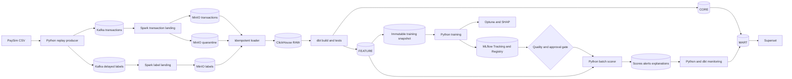

# FraudGuard: ClickHouse-centric Data Engineering & MLOps Roadmap

> Phiên bản 1.0 — cập nhật ngày 22/07/2026  
> Mục tiêu: portfolio Data Engineering/MLOps chạy local, kiểm soát chi phí và thể hiện rõ data lineage, reproducibility, model governance và monitoring.

## 1. Tóm tắt quyết định kiến trúc

FraudGuard là pipeline phát hiện gian lận batch-first trên dữ liệu PaySim synthetic. Kiến trúc duy nhất của dự án:

1. Python producer replay PaySim vào Kafka bằng Avro.
2. Spark Structured Streaming kiểm tra contract, giải mã và landing Parquet vào MinIO.
3. Loader idempotent nạp trực tiếp Parquet từ MinIO vào ClickHouse.
4. dbt Core với `dbt-clickhouse` quản lý RAW → CORE → FEATURE → MART, tests, documentation và lineage.
5. Feature definitions được version hóa trong Git; training datasets là immutable snapshots có manifest và hash.
6. Python huấn luyện model ngoài ClickHouse bằng scikit-learn/XGBoost hoặc LightGBM.
7. MLflow là nguồn sự thật duy nhất cho experiment tracking và Model Registry; PostgreSQL giữ metadata, MinIO giữ artifacts.
8. Optuna điều phối tuning; SHAP tạo global và local explanations.
9. Python batch scorer tải exact model version từ MLflow Registry, đọc feature từ ClickHouse và ghi score/alert trở lại ClickHouse.
10. Python + dbt tạo monitoring metrics; Superset chỉ đọc MART và MONITORING.

Kiến trúc này cố ý không thêm Feast, Airflow, Flink, Iceberg, Redis, Kubernetes, deep learning hoặc online inference trong phiên bản đầu.

Nguyên tắc xuyên suốt:

```text
CONTRACT
  → LAND
  → RECONCILE
  → DBT TEST
  → SNAPSHOT
  → TRAIN
  → EVALUATE
  → REGISTER
  → SCORE
  → MONITOR
  → VISUALIZE
```

## 2. Mục tiêu và tiêu chí thành công

### 2.1 Câu hỏi sản phẩm

Với ngân sách điều tra hữu hạn, giao dịch nào cần được ưu tiên để thu hồi nhiều fraud nhất mà vẫn kiểm soát false positive và số alert mỗi giờ?

Đây là bài toán **ranking + decision policy**, không chỉ là classification:

- model tạo risk score;
- policy chuyển score thành alert theo threshold/top-k và capacity;
- analyst xem queue, reason code và performance;
- delayed labels đánh giá model theo cohort thời gian.

### 2.2 Mục tiêu portfolio

Dự án phải chứng minh được:

- thiết kế event contract và schema evolution;
- streaming landing có quarantine và replayability;
- ingestion idempotent và lineage từ file tới prediction;
- mô hình dữ liệu ClickHouse phù hợp workload OLAP;
- transformation/test/documentation bằng dbt;
- feature point-in-time correct và không leakage;
- training/evaluation tái lập được;
- model promotion, rollback và batch inference có kiểm soát;
- delayed-label evaluation, drift và data quality monitoring;
- dashboard chỉ đọc semantic marts đã được kiểm thử.

### 2.3 Tiêu chí thành công phiên bản đầu

- Replay ít nhất 100.000 giao dịch không mất event hợp lệ.
- Reconcile được Kafka offsets, MinIO objects và ClickHouse rows.
- Transaction inference contract không chứa label.
- Training/validation/test split hoàn toàn theo thời gian.
- Có Dummy, rule và Logistic Regression baseline; có ít nhất một tree-based challenger.
- Chọn model bằng AUPRC và recall/precision tại alert budget, không dùng accuracy.
- Có calibration report và policy version riêng với model version.
- Mọi training run truy được về dataset snapshot, dbt manifest và Git SHA.
- MLflow Registry quản lý aliases `candidate`, `challenger`, `champion` và rollback.
- Batch scoring ghi exact model, feature, dataset và policy version.
- Superset có dashboard pipeline, fraud operations, model performance và drift.
- Toàn bộ pipeline chạy lại bằng command rõ ràng; secret không nằm trong Git.

### 2.4 Ngoài phạm vi phiên bản đầu

- Quyết định tài chính production hoặc tuyên bố business impact trên dữ liệu ngân hàng thật.
- Online scoring dưới 100 ms.
- Online feature store hoặc REST inference service.
- Auto-retraining hoặc auto-promotion không có người duyệt.
- Exactly-once end-to-end tuyệt đối.
- Multi-node ClickHouse cluster, high availability hoặc multi-region.
- Kubernetes và distributed training.

## 3. Hiện trạng repository

### 3.1 Đã có

| Thành phần | Trạng thái | Bằng chứng |
|---|---|---|
| PaySim producer | Replay có rate control, backpressure và Kafka idempotence | `producer/kafka_producer.py` |
| Kafka | KRaft single-node, 3 partitions/topic, auto-create tắt | `docker-compose.yml` |
| Schema Registry | Confluent Schema Registry | `docker-compose.yml` |
| Data contract | Transaction và label là hai Avro schemas | `schemas/*.avsc` |
| Label isolation | Transaction không chứa `isFraud`/`isFlaggedFraud` | `schemas/fraud_transaction.avsc` |
| Spark landing | Validate Confluent header/schema ID và decode Avro | `spark/jobs/kafka_to_minio.py` |
| Quarantine | Lưu message lỗi cùng error code | `spark/jobs/kafka_to_minio.py` |
| MinIO | Valid, quarantine và checkpoint buckets | `minIO/init_bucket.sh` |

### 3.2 Khoảng trống theo thứ tự ưu tiên

| Khoảng trống | Ảnh hưởng | Ưu tiên |
|---|---|---|
| Chưa có deterministic `event_time` | Không thể làm temporal ML đáng tin cậy | P0 |
| Label chưa có delay thực và chưa landing riêng | Không mô phỏng delayed feedback | P0 |
| Chưa có end-to-end deduplication contract | Replay có thể tạo duplicate business row | P0 |
| Chưa có ClickHouse service/schema | Chưa có warehouse/analytics layer | P0 |
| Chưa có MinIO → ClickHouse loader | Chưa có ingestion lineage/reconciliation | P0 |
| Chưa có dbt project | Transformation/test/lineage chưa được quản lý | P0 |
| Chưa có point-in-time features/snapshot | Chưa thể train model hợp lệ | P0 |
| Chưa có ML package và evaluation suite | Chưa có baseline | P0 |
| Chưa có MLflow/Optuna/SHAP | Chưa có reproducible MLOps | P1 |
| Chưa có scorer/monitoring/Superset | Chưa có production-like demo | P1 |
| Credentials local còn hard-code | Không phù hợp repo chia sẻ | P1 |

## 4. Kiến trúc đích



### 4.1 Ranh giới trách nhiệm

| Lớp | Trách nhiệm | Không chịu trách nhiệm |
|---|---|---|
| Kafka + Schema Registry | Event log, partition ordering, contract compatibility | Feature engineering, model scoring |
| Spark | Validate/decode, route valid/quarantine, landing Parquet, checkpoint offsets | Business features, training |
| MinIO | Immutable landing, recovery boundary, training snapshots, ML artifacts | Business SQL, model metadata |
| ClickHouse | OLAP storage, transformations, feature computation, score/monitoring tables | Experiment tracking, registry, Python training |
| dbt | SQL DAG, tests, docs, manifest, data contracts | Ingestion, model fitting, serving |
| Python ML | Dataset validation, training, tuning, evaluation, scoring, monitoring calculations | Data warehouse governance |
| MLflow | Experiments, artifacts metadata, registered models, aliases, approvals | Feature computation, BI marts |
| PostgreSQL | Durable metadata backend cho MLflow và Superset | Fraud analytics |
| Superset | Visualization trên approved marts | Business transformation logic |

### 4.2 Nguồn sự thật cho từng artifact

| Artifact | Nguồn sự thật |
|---|---|
| Event schema | Avro files trong Git + Schema Registry |
| Raw/replay data | MinIO object + ETag |
| Ingestion state | ClickHouse `monitoring.ingestion_file_audit` |
| SQL transformation | Git + dbt manifest |
| Feature definition | dbt SQL + feature contract YAML |
| Training data | Immutable snapshot manifest + Parquet hash |
| Experiment | MLflow run |
| Approved model | MLflow registered model version |
| Active deployment | MLflow model alias |
| Prediction history | ClickHouse `ml.transaction_scores` |
| Decision policy | Versioned policy config trong Git + score record |
| Monitoring metrics | ClickHouse MONITORING models |

## 5. Data contract và temporal semantics

### 5.1 Transaction schema v2

Thêm theo backward-compatible evolution:

| Field | Kiểu | Ý nghĩa |
|---|---|---|
| `event_time` | timestamp-millis | Thời gian giao dịch deterministic |
| `source_row_number` | long | Vị trí dòng trong source |
| `source_file_sha256` | string/null | Fingerprint dataset |
| `event_sequence` | long | Tie-break khi cùng timestamp |
| `amount_minor` | long/null | Monetary value dạng minor unit |

Không đổi trực tiếp `amount: double`. Thêm field mới, dual-read trong migration window rồi mới deprecate field cũ.

### 5.2 Deterministic event time

1. Chọn epoch cố định, ví dụ `2026-01-01T00:00:00Z`.
2. Mỗi PaySim `step` tương ứng một giờ.
3. Phân bố `ordinal_within_step` ổn định trong 3.600 giây.
4. Dùng `source_row_number` làm `event_sequence`.
5. Replay cùng source luôn tạo cùng `event_id`, `event_time` và `event_sequence`.

Không dùng thời gian chạy producer làm event time.

### 5.3 Delayed label

Label contract tối thiểu:

```text
event_id
label
label_source
observed_at
label_version
```

Transaction và label phải được publish bằng hai schedule độc lập. Mặc định local:

- deterministic delay từ 1–24 giờ dựa trên hash của `event_id`;
- correction được append bằng `label_version` cao hơn;
- tại cutoff chỉ dùng label có `observed_at <= cutoff`.

### 5.4 Inference allowlist/denylist

Tuyệt đối không dùng:

- `isFraud`, `isFlaggedFraud` hoặc output của rule tương đương;
- post-investigation fields;
- future transaction/future aggregates;
- raw account ID như categorical shortcut;
- post-transaction balance nếu problem statement là pre-authorization.

Feature allowlist và denylist phải được version hóa trước khi mở test set.

## 6. MinIO landing zone

### 6.1 Buckets

| Bucket | Mục đích |
|---|---|
| `fraud-transactions` | Valid transaction Parquet |
| `fraud-transactions-quarantine` | Invalid payload + error metadata |
| `fraud-transactions-checkpoint` | Spark checkpoint; không ingest |
| `fraud-transaction-labels` | Delayed labels Parquet |
| `fraud-transaction-labels-quarantine` | Invalid label payload + error metadata |
| `fraud-transaction-labels-checkpoint` | Label landing checkpoint |
| `fraud-training-snapshots` | Immutable datasets + manifests |
| `mlflow-artifacts` | Model, plots, SHAP, evaluation, model card |

### 6.2 Object layout

```text
s3://fraud-transactions/
  event_date=2026-01-03/
    batch_id=00000000000000000042/
      part-....snappy.parquet

s3://fraud-transaction-labels/
  observed_date=2026-01-04/
    batch_id=00000000000000000017/
      part-....snappy.parquet

s3://fraud-training-snapshots/
  dataset=fraud_training/
    version=20260722_feature_v1_split_v1/
      data-....parquet
      manifest.json
```

### 6.3 Row metadata bắt buộc

- Kafka topic, partition, offset và timestamp;
- writer/reader schema ID;
- Spark batch ID;
- event, ingest và processed time;
- source file hash và row number;
- pipeline version/Git SHA nếu có.

MinIO objects không bị sửa sau khi landing. Correction tạo object/event version mới.

## 7. ClickHouse foundation

### 7.1 Databases

```text
fraudguard_raw
fraudguard_core
fraudguard_feature
fraudguard_ml
fraudguard_mart
fraudguard_monitoring
```

Tên database được tách rõ để cấp quyền tối thiểu và tránh Superset đọc raw/label trực tiếp.

### 7.2 Table engine strategy

| Lớp | Engine mặc định | Lý do |
|---|---|---|
| RAW events | `MergeTree` | Append-only source history |
| Label history | `MergeTree` | Giữ mọi correction/version |
| Canonical CORE | `ReplacingMergeTree(version)` hoặc `argMax` view | Chọn record canonical có quy tắc |
| Features | `MergeTree` | Time-series analytical reads |
| Immutable snapshots | `MergeTree` + Parquet snapshot | Reproducible training |
| Scores/alerts | `MergeTree` | Không overwrite lịch sử |
| Daily marts | `SummingMergeTree`/`AggregatingMergeTree` khi có bằng chứng | Pre-aggregation có kiểm soát |

Không dựa vào background merge để bảo đảm uniqueness. Query/gate cần canonical correctness phải dùng một trong các cách đã kiểm thử:

- `argMax` theo version/offset;
- canonical materialized table;
- `FINAL` trên phạm vi bounded khi phù hợp.

Không chạy `OPTIMIZE TABLE ... FINAL` định kỳ như một cơ chế deduplication.

### 7.3 Sorting và partitioning

Nguyên tắc:

- `ORDER BY` dựa trên query pattern, không chỉ primary key logic;
- ưu tiên lọc theo event date/time, entity và event ID;
- partition theo tháng hoặc không partition cho bảng nhỏ;
- không partition theo account, batch ID hoặc dataset version có cardinality cao;
- batch insert đủ lớn để tránh quá nhiều parts nhỏ.

Mọi DDL phải có comment nêu grain, engine, sorting key, partition key, retention và deduplication semantics.

### 7.4 Roles

```text
fraudguard_loader
fraudguard_transformer
fraudguard_ml
fraudguard_superset
fraudguard_admin
```

- Loader chỉ insert RAW và ghi ingestion audit.
- Transformer đọc RAW, ghi CORE/FEATURE/MART/MONITORING.
- ML đọc FEATURE, ghi ML/MONITORING.
- Superset chỉ SELECT MART/MONITORING và masked alert detail.
- Automation không dùng admin user.

## 8. MinIO → ClickHouse loader

### 8.1 Luồng nạp

```text
List MinIO objects
  → filter Parquet objects
  → compare bucket/key/ETag with audit
  → validate size and Parquet footer
  → INSERT SELECT FROM s3(..., 'Parquet')
  → reconcile parsed/loaded rows
  → write audit status
```

Không download file xuống local và không tạo staging copy thứ hai.

### 8.2 Ingestion audit

`fraudguard_monitoring.ingestion_file_audit`:

```text
source_bucket
object_key
object_etag
object_size
dataset_type
discovered_at
load_started_at
loaded_at
clickhouse_query_id
rows_parsed
rows_loaded
min_event_time
max_event_time
status
error_class
error_message_sanitized
loader_version
```

Logical unique key: `(source_bucket, object_key, object_etag)`.

### 8.3 Idempotency contract

- Loader kiểm tra audit trước khi insert.
- Mỗi attempt có deterministic `insert_deduplication_token` khi driver hỗ trợ và đã được integration-test.
- Crash sau insert nhưng trước audit phải được reconcile bằng query ID, source object columns và row count.
- RAW lưu `source_bucket`, `source_object_key`, `source_object_etag` trong mỗi row.
- CORE vẫn deduplicate theo business key; loader idempotency không thay business deduplication.
- Không retry vô hạn contract error/corrupt Parquet.

### 8.4 Tần suất

Phiên bản đầu chạy micro-batch mỗi 1–5 phút bằng command self-terminating. Chưa cần ingest Kafka trực tiếp vào ClickHouse vì MinIO là recovery boundary đã chọn.

## 9. dbt-clickhouse transformation layer

### 9.1 Phạm vi

dbt chịu trách nhiệm:

- khai báo RAW tables là sources;
- cast/normalize trong STAGING;
- canonicalize/deduplicate trong CORE;
- xây point-in-time feature inputs;
- materialize training spine và dataset metadata;
- tạo MART/MONITORING cho Superset;
- tests, descriptions, exposures và build artifacts.

dbt không đọc MinIO, train model hoặc gọi MLflow Registry.

### 9.2 Cấu trúc

```text
dbt/fraudguard/
├── dbt_project.yml
├── packages.yml
├── macros/
│   ├── canonical_event.sql
│   ├── safe_divide.sql
│   └── point_in_time_assertions.sql
├── models/
│   ├── staging/
│   ├── core/
│   ├── features/
│   ├── marts/
│   └── monitoring/
├── tests/
├── seeds/
└── snapshots/
```

### 9.3 Modeling rules

- STAGING: rename/cast/null normalization; không business aggregation.
- CORE: typed, canonical, stable grain, lineage đầy đủ.
- FEATURE: chỉ lịch sử trước event hiện tại; không join label trừ training spine.
- MART: metric có định nghĩa duy nhất và owner.
- MONITORING: data quality, drift, delayed-label performance và SLO.
- Không dùng `SELECT *` trong contracted model.
- Schema change mặc định fail cho model phục vụ training/scoring.

### 9.4 Tests bắt buộc

- Event ID non-null và canonical unique.
- Enum transaction type hợp lệ.
- Amount finite, range hợp lệ.
- Transaction inference relation không có label.
- `event_time` không vượt allowed ingest tolerance.
- `observed_at >= event_time`.
- Feature timestamp không vượt spine event time.
- Current event không tự đếm trong history.
- Future event không đổi feature quá khứ.
- CORE count reconcile với RAW distinct business keys.
- Superset exposures chỉ phụ thuộc MART/MONITORING.

CI lưu `manifest.json`, `run_results.json` và hash tương ứng.

## 10. Feature engineering và dataset snapshots

### 10.1 Feature groups V1

**Transaction**

- transaction type;
- `log1p(amount)`;
- origin/destination pre-transaction balance;
- amount/balance ratios có safe divide;
- balance inconsistency flags;
- hour-of-day/day index.

**Origin velocity**

- count/sum/max trong 1h, 6h, 24h;
- transfer/cash-out count;
- unique destinations;
- amount so với historical mean/median;
- seconds since previous transaction.

**Destination velocity**

- incoming count/sum trong 1h/24h;
- unique origins;
- new-origin count;
- seconds since previous receipt.

**Pattern**

- transfer → cash-out sequence;
- burst indicator;
- repeated round amount;
- new counterparty;
- amount spike.

### 10.2 Point-in-time rule

Với transaction hiện tại `(event_time=t, event_sequence=s)`, history hợp lệ chỉ gồm:

```text
(historical_event_time, historical_event_sequence) < (t, s)
```

Tất cả rolling/ASOF logic phải có golden fixture kiểm tra boundary, tie-break và out-of-order events.

### 10.3 Feature contract

Mỗi feature group có file YAML trong Git:

```text
name
version
owner
entity_keys
timestamp_column
feature columns and types
null/default policy
semantic description
availability at inference
source dbt models
freshness expectation
deprecation policy
```

Thay đổi logic, window, unit, null policy hoặc availability phải tạo feature version mới.

### 10.4 Immutable training snapshot

Training spine gồm:

```text
event_id
event_time
event_sequence
entity keys
label
label_observed_at
training_cutoff
split_name
dataset_version
```

Snapshot procedure:

1. Chốt feature/split/label policy versions.
2. Chạy `dbt build --select tag:ml_gate`.
3. Materialize dataset version trong ClickHouse.
4. Kiểm tra row count, nulls, min/max time, positive count và feature schema.
5. Export Parquet sang MinIO.
6. Tạo `manifest.json` chứa object hashes, query hash, dbt manifest hash và Git SHA.
7. Đánh dấu dataset immutable; rebuild cùng input phải tạo cùng content hash trong tolerance đã định.

Training luôn đọc exact snapshot version, không đọc một mutable feature view trực tiếp.

## 11. ML training và evaluation

### 11.1 Package boundaries

```text
ml/src/fraudguard_ml/
├── dataset.py
├── contracts.py
├── leakage.py
├── features.py
├── split.py
├── train.py
├── evaluate.py
├── calibrate.py
├── policy.py
├── tracking.py
├── tune.py
├── explain.py
├── registry.py
├── score.py
└── monitor.py
```

Notebook chỉ dùng cho exploration/report; logic sản xuất nằm trong importable package và có tests.

### 11.2 Temporal split

- Train: 60% thời gian đầu.
- Validation/calibration: 20% tiếp theo.
- Test: 20% cuối.
- Dùng walk-forward folds khi tuning.
- Duplicate event không được nằm ở nhiều split.
- Preprocessing/imputation/encoding chỉ fit trên train.
- Threshold và calibration chỉ chọn trên validation/calibration.
- Test chỉ mở sau khi model family, search space và policy đã khóa.

Split boundaries được lưu trong versioned manifest.

### 11.3 Model ladder

1. `DummyClassifier(strategy="prior")`.
2. Rule baseline, nhưng rule output không làm feature.
3. Logistic Regression với preprocessing pipeline và class weighting.
4. HistGradientBoosting.
5. XGBoost hoặc LightGBM challenger.

Không bắt đầu bằng deep learning. Với tabular synthetic fraud, feature correctness và evaluation quan trọng hơn model complexity.

### 11.4 Metrics

| Nhóm | Metrics |
|---|---|
| Ranking | AUPRC/Average Precision; ROC-AUC chỉ phụ |
| Operations | Precision@k, Recall@k, alerts/hour, false positives/day |
| Calibration | Brier score, reliability bins, ECE có định nghĩa rõ |
| Threshold | F2, MCC, confusion matrix |
| Robustness | Metric theo time/type/amount/activity segment |
| Runtime | Training/scoring duration, rows/sec, memory peak |
| Evidence | Positive count, label coverage, confidence intervals |

Accuracy không được dùng để chọn model.

### 11.5 Decision policy

Model và policy là hai artifacts riêng:

- model version tạo score;
- policy version quyết định threshold/top-k;
- budget mặc định: 50 alerts/hour;
- sensitivity report tại 10 và 100 alerts/hour;
- tie-break deterministic theo score, event time và event ID.

## 12. MLflow Tracking và Model Registry

### 12.1 Deployment

```text
Training/scoring process
  → MLflow Tracking Server
      → PostgreSQL metadata database
      → MinIO mlflow-artifacts bucket
```

MLflow là registry duy nhất. Không tạo registry thứ hai trong ClickHouse.

### 12.2 Required run metadata

Tags:

```text
git_sha
dataset_name
dataset_version
dataset_manifest_sha256
feature_versions
dbt_manifest_sha256
schema_version
split_version
problem_definition
alert_budget
environment_lock_sha256
```

Artifacts:

```text
model/
feature_schema.json
dataset_manifest.json
split_manifest.json
evaluation.json
pr_curve.png
calibration_curve.png
confusion_matrix.png
shap_summary.png
model_card.md
requirements.lock
```

### 12.3 Registry lifecycle

```text
FINISHED MLflow run
  → automated quality gates
  → artifact hash verification
  → prediction parity test
  → SHAP/privacy review
  → human approval
  → registered model version
  → candidate alias
  → challenger batch comparison
  → champion alias
```

Không retrain trong promotion. Exact artifact đã được đánh giá mới được register.

### 12.4 Promotion gates

```text
data_quality_passed
AND point_in_time_tests_passed
AND leakage_audit_passed
AND candidate.val_auprc > baseline.val_auprc
AND candidate.recall_at_budget >= minimum_recall
AND candidate.calibration_within_tolerance
AND no_severe_segment_regression
AND scoring_schema_compatible
AND serialization_parity_passed
AND human_approval
```

Rollback chỉ đổi `champion` alias về immutable version trước. Không xóa prediction history.

## 13. Optuna và SHAP

### 13.1 Optuna

- Chỉ bật sau khi baseline/split/metrics ổn định.
- Persistent study dùng PostgreSQL database riêng `optuna`.
- Mỗi trial ánh xạ tới nested MLflow run.
- Cố định dataset, feature và split version trong study attributes.
- Dùng seeded TPE sampler và pruning có kiểm soát.
- Giới hạn trials, timeout, CPU và memory.
- Không tune theo test metric.
- Không auto-promote `best_trial`.

Objective mặc định: maximize mean temporal-fold AUPRC, với recall@budget là constraint hoặc secondary objective.

### 13.2 SHAP

- Linear model: coefficient report hoặc `LinearExplainer`.
- Tree models: `TreeExplainer`.
- Background/explanation samples có fixed seed.
- Log output space: margin/log-odds/probability.
- Map encoded names về business feature names.
- Global artifacts: mean absolute SHAP, beeswarm, dependence và fold stability.
- Local explanations: chỉ top-N reasons cho alerts hoặc monitoring sample.
- Không lưu raw account identifiers.
- SHAP là association-based explanation, không phải causal proof.

## 14. Batch scoring

### 14.1 Scoring flow

1. Loader hoàn thành micro-batch và reconciliation.
2. dbt refresh CORE/FEATURE models.
3. Scorer resolve `champion` alias thành exact MLflow version.
4. Validate feature contract/signature.
5. Đọc unscored feature rows từ ClickHouse theo bounded batch.
6. Score trong Python bằng exact serialized pipeline.
7. Áp dụng versioned decision policy.
8. Ghi scores, alerts và top-N reasons vào ClickHouse.
9. Commit scoring batch audit sau khi row reconciliation pass.

### 14.2 Score grain

```text
(event_id, model_name, model_version, feature_version, policy_version)
```

Không overwrite score cũ khi model/policy thay đổi.

### 14.3 Tables

`fraudguard_ml.transaction_scores`:

```text
event_id
event_time
scoring_batch_id
model_name
model_version
mlflow_run_id
feature_version
prediction_score
scored_at
scorer_git_sha
```

`fraudguard_ml.alert_decisions`:

```text
event_id
model_version
policy_version
threshold
alert_rank
is_alert
decision_at
```

`fraudguard_ml.transaction_explanations` lưu top-N business-safe reasons và exact model/feature version.

## 15. Monitoring và delayed-label evaluation

### 15.1 Monitoring contract

Prediction ghi ngay; label có thể đến sau. Tách hai loại metric:

**Không cần label**

- score distribution drift;
- feature distribution/null drift;
- prediction volume;
- scoring latency/failure;
- alert volume và budget violation.

**Cần mature label**

- AUPRC;
- precision/recall@budget;
- Brier/calibration;
- prevalence;
- segment performance.

Performance query chỉ đọc cohort đã mature theo label policy. Dashboard luôn hiển thị sample size, positive count và label coverage.

### 15.2 Monitoring implementation

- dbt tạo daily/hourly data quality và volume marts.
- Python job tính AUPRC, calibration, PSI/KS/distribution distances và confidence intervals.
- Metric rows ghi vào `fraudguard_monitoring.model_metrics` với exact model, feature, policy và cohort versions.
- Baseline distributions là immutable artifacts, không recompute âm thầm.
- Drift mở investigation; không tự động retrain.

### 15.3 Alert policies

- Contract/data quality failure: chặn scoring.
- Loader/reconciliation failure: chặn downstream batch.
- Low label coverage: suppress performance alert và báo `INSUFFICIENT_LABELS`.
- Drift breach: mở investigation.
- Mature performance regression: xem xét rollback/challenger.
- MLflow/MinIO artifact unavailable: scoring fail closed, không fallback sang model không xác định.

## 16. Superset

Superset dùng `clickhouse-connect` và một ClickHouse user read-only. Chỉ đọc:

- `fraudguard_mart.*`;
- `fraudguard_monitoring.*`;
- masked alert-detail view đã được approve.

### Dashboard 1 — Pipeline & data quality

- latest MinIO object/ClickHouse load;
- file status và loader latency;
- parsed vs loaded rows;
- duplicate/quarantine rate;
- event-time freshness;
- schema ID distribution.

### Dashboard 2 — Fraud operations

- alert queue theo risk band;
- alerts/hour vs budget;
- score và amount distribution;
- false-positive volume;
- masked transaction detail và top-N reasons.

### Dashboard 3 — Model performance

- AUPRC, precision@k, recall@k;
- Brier/calibration;
- label coverage/sample size;
- segment metrics;
- champion vs challenger.

### Dashboard 4 — Drift

- feature/score distribution shift;
- null drift;
- volume/prevalence shift;
- cohort size và confidence warning.

Business metrics được định nghĩa trong dbt, không viết lại tùy ý trong từng chart.

## 17. Repository structure đích

```text
ML_Fraud_Banking/
├── README.md
├── ROADMAP.md
├── DATA_CONTRACT.md
├── MODEL_CARD.md
├── docker-compose.yml
├── .env.example
├── pyproject.toml
├── uv.lock
├── producer/
│   ├── kafka_producer.py
│   └── delayed_label_producer.py
├── schemas/
├── spark/jobs/
│   ├── kafka_to_minio.py
│   └── kafka_labels_to_minio.py
├── minIO/
│   └── init_bucket.sh
├── clickhouse/
│   ├── README.md
│   ├── config.d/
│   ├── users.d/
│   ├── ddl/
│   └── loader/
│       └── minio_to_clickhouse.py
├── dbt/fraudguard/
│   ├── dbt_project.yml
│   ├── models/
│   ├── macros/
│   └── tests/
├── ml/
│   ├── configs/
│   ├── contracts/
│   ├── src/fraudguard_ml/
│   └── notebooks/
├── mlflow/
│   ├── README.md
│   └── retention_policy.md
├── superset/
│   ├── Dockerfile
│   ├── requirements-local.txt
│   └── dashboards/
├── scripts/
│   ├── bootstrap_clickhouse.py
│   ├── build_training_snapshot.py
│   ├── promote_model.py
│   └── run_monitoring.py
└── tests/
    ├── unit/
    ├── contract/
    ├── integration/
    ├── dbt/
    ├── ml/
    └── e2e/
```

Data, Kafka logs, checkpoints, secrets, model binaries, MLflow metadata và notebook outputs lớn không được commit.

## 18. Roadmap thực thi

### M0 — Problem, contracts và local foundations

**Công việc**

- Chốt pre-transaction detection.
- Chốt primary metrics và alert budget.
- Tạo source manifest cho PaySim.
- Pin compatible dependency/container versions.
- Tách secrets khỏi Compose thành `.env.example`.

**Exit criteria**

- Problem statement, metric dictionary và intended use/misuse được review.
- Không còn ambiguity về field availability tại inference.

### M1 — Deterministic event time và delayed labels

**Công việc**

- Nâng transaction schema v2.
- Tạo stable event time/sequence/source fingerprint.
- Implement delayed label producer/schedule.
- Tạo fixture normal, fraud, duplicate, malformed và out-of-order.

**Exit criteria**

- Replay cùng row tạo cùng ID/time/sequence.
- Transaction không chứa label.
- Label thực sự đến sau theo deterministic policy.

### M2 — Complete MinIO landing

**Công việc**

- Landing cả transaction và label.
- Hoàn thiện object layout và metadata.
- Kiểm tra checkpoint/restart/quarantine.
- Thêm training-snapshot và MLflow artifact buckets.

**Exit criteria**

- Có thể khôi phục valid transactions và labels chỉ từ MinIO.
- Replay không tăng distinct business events.

### M3 — ClickHouse foundation

**Công việc**

- Thêm pinned ClickHouse service và persistent volume.
- Tạo databases, users, roles, quotas và DDL versioned.
- Thiết kế RAW/label/audit tables.
- Thêm healthcheck, backup/restore smoke và query logging policy.

**Exit criteria**

- Bootstrap từ empty volume bằng một command.
- Role tests chứng minh least privilege.
- Restart không mất data.

### M4 — Idempotent MinIO loader

**Công việc**

- Implement object discovery, audit, direct `s3()` load và reconciliation.
- Thêm dry-run, `--limit-files` và bounded retries.
- Lưu source object lineage trong từng RAW row.

**Exit criteria**

- Load/retry cùng object không tăng canonical business rows.
- Crash recovery và corrupt-file paths có integration tests.
- 100.000 transactions được reconcile.

### M5 — dbt CORE và data quality

**Công việc**

- Khởi tạo `dbt-clickhouse` project.
- Xây STAGING/CORE canonical models.
- Thêm tests, descriptions, exposures và manifests.
- Tạo initial pipeline/data-quality marts.

**Exit criteria**

- `dbt build` pass trên RAW fixture.
- CORE reconcile với MinIO/RAW.
- Mọi excluded row có reason.

### M6 — EDA và leakage audit

**Công việc**

- Temporal prevalence/type/amount analysis.
- Entity overlap và duplicate analysis theo split.
- Pre/post-transaction availability audit.
- Label delay/coverage analysis.
- Chốt feature allowlist/denylist.

**Exit criteria**

- EDA report tái lập được bằng fixed snapshot/seed.
- Leakage review pass trước feature implementation.

### M7 — Point-in-time features và immutable snapshot

**Công việc**

- Xây transaction/origin/destination/pattern feature models.
- Thêm feature contracts và versioning.
- Tạo training spine, temporal split manifest và export snapshot.
- Golden tests cho current/future/tie/out-of-order boundaries.

**Exit criteria**

- Point-in-time/leakage suite pass 100%.
- Snapshot truy được về MinIO objects, ClickHouse query, dbt manifest và Git SHA.
- Rebuild deterministic trong tolerance.

### M8 — Baseline + MLflow

**Công việc**

- Thêm PostgreSQL + MLflow Tracking Server.
- Train Dummy/rule/Logistic Regression.
- Log đầy đủ data/model/evaluation artifacts.
- Đăng ký candidate đầu tiên và test serialization parity.

**Exit criteria**

- MLflow restart không mất metadata/artifacts.
- Một run được load lại và tạo prediction parity.
- Test chưa được dùng để tune.

### M9 — Challenger, tuning, calibration và explanations

**Công việc**

- Train HistGradientBoosting và XGBoost hoặc LightGBM.
- Optuna walk-forward study với budget.
- Calibration và alert-budget policy.
- SHAP global/local explanation và segment analysis.

**Exit criteria**

- Candidate chỉ thắng theo gate định trước.
- Test mở đúng một lần sau khi model/policy đã khóa.
- Model card nêu limitations/failure modes.

### M10 — Registry promotion và batch scoring

**Công việc**

- Implement automated gates, approval record và alias transitions.
- Implement bounded idempotent scorer.
- Ghi scores, decisions, explanations và batch audit.
- Diễn tập champion rollback.

**Exit criteria**

- Chỉ registered/approved exact version được score.
- Transaction trace được từ MinIO object tới score/model version.
- Rollback không xóa lịch sử.

### M11 — Monitoring, Superset và final demo

**Công việc**

- Xây delayed-label monitoring pipeline.
- Tạo data/model/operations marts.
- Kết nối Superset bằng read-only role.
- Tạo bốn dashboards và end-to-end runbook.
- Hoàn thiện README, contracts và model card.

**Exit criteria**

- Demo từ replay tới dashboard bằng command sequence.
- Dashboard không đọc RAW và không lộ raw identifiers.
- Runbook phân biệt data failure, drift, performance regression và insufficient labels.

## 19. Test strategy

### 19.1 Unit

- Stable event ID/time/sequence.
- MinIO object filter và loader state transitions.
- Metric/threshold deterministic tie-break.
- Feature calculation trên fixture nhỏ.
- MLflow required metadata validator.
- Optuna objective và seed.
- SHAP name mapping/top-N reasons.
- Registry promotion gate evaluator.

### 19.2 Contract

- Avro backward compatibility và label isolation.
- Parquet ↔ ClickHouse type compatibility.
- dbt source/model contracts.
- Feature schema/version contract.
- Snapshot manifest/hash contract.
- MLflow run/registry metadata contract.
- Scoring input/output contract.

### 19.3 Integration

- Kafka → Spark → MinIO.
- MinIO → ClickHouse RAW + audit.
- RAW → dbt CORE reconciliation.
- dbt features → immutable snapshot.
- Training → MLflow PostgreSQL + MinIO artifacts.
- Optuna trial → nested MLflow run.
- MLflow Registry → batch score → ClickHouse.
- Scores + labels → monitoring metrics.
- Superset role đọc MART nhưng bị chặn RAW/FEATURE.

### 19.4 ML validation

- Temporal boundaries và entity/duplicate leakage.
- Train-only preprocessing.
- Baseline comparison.
- Calibration và alert budgets.
- Confidence intervals và segment performance.
- Determinism/serialization parity.
- SHAP additivity/stability/privacy.
- Champion/challenger regression gates.
- Drift/no-drift fixtures và label coverage gate.

### 19.5 End-to-end

1. Replay 100.000 rows.
2. Xác nhận Kafka delivery.
3. Xác nhận MinIO valid/quarantine/labels.
4. Load ClickHouse và reconcile audit.
5. Chạy `dbt build`.
6. Build immutable training snapshot.
7. Train/evaluate/register model.
8. Promote approved version.
9. Score unseen micro-batch.
10. Join mature labels và refresh monitoring.
11. Validate Superset dashboards.

Mỗi boundary kiểm tra row count, distinct event key, min/max event time, positive count và lineage; không chỉ assert exit code 0.

## 20. Security, reliability và cost controls

- Không commit `.env`, credentials, tokens hoặc raw private identifiers.
- Dùng service accounts riêng cho MinIO, ClickHouse, MLflow và Superset.
- Superset chỉ SELECT approved views.
- MLflow và Superset metadata dùng PostgreSQL persistent volumes và backup.
- MLflow artifact access đi qua service account tối thiểu quyền.
- Không expose Kafka, MinIO, ClickHouse, MLflow hoặc Superset public nếu chưa có auth/TLS/reverse proxy.
- Pin image tags/digests và Python lockfile; không dùng `latest`.
- Giới hạn ClickHouse memory, threads, query time và disk.
- Giới hạn Optuna trials/timeout/parallelism.
- Hash/mask account identifiers trong marts, explanations và logs.
- Có retention cho raw data, training snapshots, artifacts, explanations và scores.
- Thực hành backup/restore ClickHouse, PostgreSQL và MinIO trước final demo.

## 21. Command contract mục tiêu

```bash
uv sync --frozen

make infra-up
make buckets
make clickhouse-bootstrap
make replay-smoke LIMIT=1000 SPEED=100
make spark-land
make clickhouse-load LIMIT_FILES=10
make reconcile
make dbt-build TARGET=dev
make snapshot DATASET_VERSION=...
make mlflow-up
make train CONFIG=ml/configs/baseline.yaml
make tune CONFIG=ml/configs/optuna.yaml
make evaluate RUN_ID=...
make explain RUN_ID=...
make register RUN_ID=...
make promote MODEL_VERSION=... ALIAS=champion
make score MODEL_ALIAS=champion
make monitor MODEL_VERSION=...
make superset-up
make e2e
```

CI commands phải self-terminating. Streaming demo có timeout/stop contract rõ ràng.

## 22. Definition of Done

- [ ] Source manifest có SHA-256, row count, step range, schema và license note.
- [ ] Transaction v2 có deterministic event time/sequence.
- [ ] Label landing riêng và có observed delay thực.
- [ ] Kafka → MinIO restart/replay được kiểm thử.
- [ ] MinIO object → ClickHouse row có lineage đầy đủ.
- [ ] Loader idempotent theo bucket/key/ETag và có crash recovery.
- [ ] RAW append-only; CORE canonical correctness đã được kiểm thử.
- [ ] dbt docs/tests/build artifacts đầy đủ.
- [ ] Feature allowlist/denylist và contracts được version hóa.
- [ ] Point-in-time tests pass.
- [ ] Immutable snapshot có manifest/hash và rebuild parity.
- [ ] Temporal split manifest được lưu.
- [ ] Dummy, Logistic Regression và tree challenger được đánh giá.
- [ ] AUPRC, recall/precision@budget, calibration và uncertainty có trong report.
- [ ] MLflow Tracking dùng PostgreSQL metadata và MinIO artifacts.
- [ ] Mọi run có required tags/metrics/artifacts.
- [ ] Optuna study resume được và trial trace tới MLflow.
- [ ] SHAP qua additivity/stability/privacy checks.
- [ ] MLflow Registry là registry duy nhất.
- [ ] Promotion, aliases, approval, parity và rollback được kiểm thử.
- [ ] Batch score trace được về model/data/feature/policy versions.
- [ ] Delayed-label evaluation báo coverage/sample size.
- [ ] Monitoring phân biệt drift và mature performance.
- [ ] Superset chỉ đọc MART/MONITORING.
- [ ] Secrets/raw identifiers không xuất hiện trong Git/log/dashboard.
- [ ] End-to-end test reconcile mọi boundary.
- [ ] README, DATA_CONTRACT và MODEL_CARD nêu rõ giới hạn synthetic data.

## 23. Rủi ro và giới hạn

### 23.1 Synthetic-to-real gap

PaySim không phản ánh đầy đủ fraud adaptation, concept drift, investigation workflow hoặc regulatory constraints. Kết quả chỉ chứng minh phương pháp và engineering capability.

### 23.2 Event-time và delayed-label gap

Mọi feature/model trước khi hoàn thành M1 chỉ là prototype, không được dùng làm final evidence.

### 23.3 ClickHouse deduplication semantics

`ReplacingMergeTree` xử lý duplicate bất đồng bộ. Canonical reads, counts và ML snapshots phải dùng patterns đã test; không giả định database enforce unique key kiểu OLTP.

### 23.4 Point-in-time SQL complexity

Rolling windows, tied timestamps và out-of-order events dễ gây leakage. Golden fixtures và future-row invariance tests là release gate bắt buộc.

### 23.5 Self-hosted operations

Local stack cần tự quản lý disk, backups, upgrades, memory limits và service credentials. Single-node demo không đại diện production HA.

### 23.6 Batch-first limitation

Đây là near-real-time landing + micro-batch scoring, không phải real-time fraud blocking. Online inference chỉ được xem xét khi đã có latency/freshness SLO và offline/online parity tests.

### 23.7 Toolchain complexity

PostgreSQL, MLflow và Superset thêm stateful services. Triển khai tuần tự theo milestones; giữ manual commands hoạt động trước orchestration.

## 24. Thứ tự bắt đầu khuyến nghị

1. Hoàn thành M0–M2 trước khi thêm ClickHouse.
2. Dựng ClickHouse DDL và loader nhỏ trên fixture.
3. Chuyển CORE/data quality vào dbt.
4. Chứng minh point-in-time correctness trước khi train model.
5. Tạo immutable snapshot trước khi dựng MLflow.
6. Train baseline trước tuning/challenger.
7. Dùng MLflow Registry chỉ sau khi artifact reload parity pass.
8. Score batch trước monitoring/dashboard.
9. Chỉ thêm orchestration hoặc online inference khi batch pipeline hoàn chỉnh.

## 25. Tài liệu chính thức

- ClickHouse documentation: <https://clickhouse.com/docs>
- ClickHouse S3 integration: <https://clickhouse.com/integrations/amazon_s3>
- ClickHouse Kafka integration: <https://clickhouse.com/integrations/kafka>
- ClickHouse + dbt: <https://clickhouse.com/integrations/dbt>
- ClickHouse Python integration: <https://clickhouse.com/integrations/python>
- ClickHouse + Superset: <https://clickhouse.com/integrations/superset>
- dbt tests: <https://docs.getdbt.com/docs/build/data-tests>
- MLflow Tracking: <https://mlflow.org/docs/latest/ml/tracking/>
- MLflow Model Registry: <https://mlflow.org/docs/latest/ml/model-registry/>
- MLflow self-hosting: <https://mlflow.org/docs/latest/self-hosting/architecture/>
- Optuna: <https://optuna.readthedocs.io/en/stable/>
- SHAP: <https://shap.readthedocs.io/en/latest/>
- Superset database connections: <https://superset.apache.org/user-docs/databases/>
